```mermaid {theme: 'dark', scale: 0.5}
graph LR
    A[2024] --> B[2029]
    B --> C[2034]

    A -->|HNW Demand| D[↗️ +45%]
    A -->|Advisor Supply| E[↘️ -15%]

    style D fill:#059669
    style E fill:#dc2626
\```
```

# Migration Guide: From Mermaid to Custom Components

This guide shows how to replace Mermaid charts in your slides with modern custom Vue components.

## Quick Reference Table

| Mermaid Chart Type | Custom Component | Use Case |
|-------------------|------------------|----------|
| Quadrant Chart | `<CompetitiveQuadrant />` | Competitive positioning |
| Flow Diagram | `<FlowDiagram />` | Process flows, old vs new |
| Pie Chart | `<PieChart />` | Budget allocation, percentages |
| Timeline | `<TimelineChart />` | Trends over time |
| Architecture | `<ArchitectureDiagram />` | System design |

## Before & After Examples

### 1. Competitive Quadrant

**Before (Mermaid):**
```md
```mermaid {theme: 'dark', scale: 0.65}
quadrantChart
    title US Wealth Management Competitive Map
    x-axis Low Tech --> High Tech
    y-axis Mass Market --> HNW/Family Office

    quadrant-1 "AI-Powered HNW (Our Space)"
    quadrant-2 "Legacy HNW Platforms"
    quadrant-3 "Robo-Advisors (Commoditized)"
    quadrant-4 "Future Potential"

    Wealthfront: [0.25, 0.20]
    Betterment: [0.30, 0.15]
    "Our Platform": [0.85, 0.90]
\```
```

**After (Custom Component):**
```vue
<CompetitiveQuadrant
  x-label="Low Tech → High Tech"
  y-label="Mass Market → HNW/Family Office"
  :quadrant-labels="[
    'AI-Powered HNW (Our Space)',
    'Legacy HNW Platforms',
    'Robo-Advisors (Commoditized)',
    'Future Potential'
  ]"
/>
```

**Benefits:**
- ✅ Animated hover effects
- ✅ Better visual hierarchy
- ✅ Consistent with brand colors
- ✅ Responsive design

---

### 2. Flow Diagram (Old vs New Model)

**Before (Mermaid):**
```md


**After (Custom Component):**
```vue
<TwoColumnLayout>
  <div>
    <div class="text-xl font-semibold mb-3">❌ The Old Model</div>
    <FlowDiagram type="old" />
  </div>

  <div>
    <div class="text-xl font-semibold mb-3">✅ Our Model</div>
    <FlowDiagram type="new" />
  </div>
</TwoColumnLayout>
```

**Benefits:**
- ✅ Cleaner SVG rendering
- ✅ Animated connections
- ✅ Side-by-side comparison built-in
- ✅ No Mermaid syntax to learn

---

### 3. Pie Chart

**Before (Mermaid):**
```md


**After (Custom Component):**
```vue
<PieChart
  title="Use of Funds"
  :size="350"
  :data="[
    { label: 'Product & Engineering', value: 40, color: '#3b82f6' },
    { label: 'API & Integration', value: 30, color: '#14b8a6' },
    { label: 'HNW Acquisition', value: 20, color: '#a855f7' },
    { label: 'Operations', value: 10, color: '#f59e0b' }
  ]"
/>
```

**Benefits:**
- ✅ Animated segments
- ✅ Interactive legend
- ✅ Custom colors matching your brand
- ✅ Percentage labels

---

### 4. Timeline/Line Chart

**Before (Mermaid):**
```md


**After (Custom Component):**
```vue
<TimelineChart title="Advisor Shortage Projection" />
```

**Benefits:**
- ✅ Smooth animated lines
- ✅ Professional chart styling
- ✅ Clear trend visualization
- ✅ Built-in annotations

---

### 5. Architecture Diagram

**Before (Mermaid):**
```md


**After (Custom Component):**
```vue
<ArchitectureDiagram title="API-First Design" />
```

**Benefits:**
- ✅ Consistent node styling
- ✅ Professional connection lines
- ✅ Animated pulse on key nodes
- ✅ Better label positioning

---

## Step-by-Step Migration Process

### Step 1: Identify Mermaid Charts
Search your slides for Mermaid code blocks:
```bash
grep -n "```mermaid" slides.md
```

### Step 2: Choose Replacement Component
Use the quick reference table above to pick the appropriate component.

### Step 3: Extract Data
Pull out the data from your Mermaid chart:
- Node names
- Relationships
- Values/percentages
- Labels

### Step 4: Replace with Component
Copy the "After" example and customize with your data.

### Step 5: Adjust Styling
Fine-tune colors, sizes, and layout using component props.

---

## Converting Custom Mermaid Charts

For Mermaid charts that don't have a direct replacement:

### Option 1: Use HighlightBox for Simple Info
```vue
<HighlightBox title="Key Insight" icon="💡" color="teal" variant="gradient">
  Your content here instead of a simple diagram
</HighlightBox>
```

### Option 2: Use Layout Components
```vue
<ThreeColumnLayout>
  <StatCard value="Step 1" label="Description" color="blue" />
  <StatCard value="Step 2" label="Description" color="teal" />
  <StatCard value="Step 3" label="Description" color="green" />
</ThreeColumnLayout>
```

### Option 3: Create New Custom Component
Follow the pattern in existing chart components:
1. Create file in `components/charts/`
2. Use SVG for custom visualizations
3. Add TypeScript props interface
4. Include animations with CSS

---

## Migration Checklist

- [ ] Backup original `slides.md`
- [ ] List all Mermaid charts in your deck
- [ ] Map each chart to a custom component
- [ ] Replace one slide at a time
- [ ] Test with `npm run dev`
- [ ] Verify animations and interactions
- [ ] Check responsive behavior
- [ ] Build for production `npm run build`

---

## Common Patterns

### Pattern 1: Three-Column Stats
Replace multiple separate stat blocks:
```vue
<ThreeColumnLayout :gap="6">
  <StatCard value="$107T" label="Total Wealth" color="teal" :animate="true" />
  <StatCard value="7.9M" label="Millionaires" color="blue" />
  <StatCard value="46%" label="Switching" color="orange" />
</ThreeColumnLayout>
```

### Pattern 2: Problem-Solution-Outcome
Replace complex journey diagrams:
```vue
<ThreeColumnLayout>
  <PersonaJourneyCard emoji="😟" title="Pain" color="red" ... />
  <PersonaJourneyCard emoji="🤖" title="AI Solution" color="blue" ... />
  <PersonaJourneyCard emoji="✅" title="Outcome" color="green" ... />
</ThreeColumnLayout>
```

### Pattern 3: Process Steps
Replace sequence diagrams:
```vue
<WorkflowSteps :steps="[
  { emoji: '1️⃣', title: 'Input', description: '...', color: 'blue' },
  { emoji: '2️⃣', title: 'Process', description: '...', color: 'teal' },
  { emoji: '3️⃣', title: 'Output', description: '...', color: 'green' }
]" />
```

---

## Tips for Success

1. **Start Simple**: Migrate one slide at a time
2. **Use Dev Mode**: Run `npm run dev` to see changes instantly
3. **Consistent Colors**: Stick to your brand palette
4. **Test Animations**: Ensure smooth transitions
5. **Mobile Check**: Verify responsive behavior
6. **Performance**: Custom components are lighter than Mermaid

---

## Need Help?

- Check `COMPONENTS.md` for detailed component documentation
- View `slides-demo-components.md` for live examples
- Refer to existing component source code in `components/` directory

---

## Performance Benefits

**Mermaid Charts:**
- Heavy JavaScript runtime
- Slower initial load
- Limited customization
- Generic styling

**Custom Components:**
- ✅ Lightweight Vue components
- ✅ Faster render times
- ✅ Full control over styling
- ✅ Smooth CSS animations
- ✅ Better mobile experience
- ✅ Consistent brand identity

---

## Conclusion

Migrating from Mermaid to custom components gives you:
- **Better Performance**: Faster load and render times
- **More Control**: Customize every aspect
- **Brand Consistency**: Match your visual identity
- **Interactivity**: Hover effects, animations, smooth transitions
- **Maintainability**: Reusable, documented components

Start with high-impact slides (title, key metrics, competitive landscape) and work your way through the deck!
