# The AI-Powered Digital Family Office

<div class="text-3xl font-light mb-8 leading-relaxed">
Institutional-Grade Wealth Management<br/>For the Next Generation
</div>

<div class="text-xl font-medium text-teal-400">
Agentic AI • Tax Alpha • Alternative Access
</div>

<div class="abs-br m-8 text-base font-medium text-teal-400">
November 2025
</div>

---
layout: section
background: https://images.unsplash.com/photo-1551288049-bebda4e38f71?auto=format&fit=crop&w=1920&q=80
---

# The New Market Opportunity

<div class="text-3xl font-light mt-4 text-teal-300">
US High-Net-Worth Wealth in Motion
</div>

---

# The $107T "Stranded" Wealth Opportunity

<div class="grid grid-cols-3 gap-6 mt-8 max-h-[70vh]">

<div class="flex flex-col items-center justify-center p-6 bg-blue-900/20 rounded-xl border-2 border-blue-500/40">
<div class="text-7xl font-bold text-blue-400 mb-4">39.7%</div>
<div class="text-lg font-medium text-center leading-relaxed">of world's millionaires<br/>are in the US</div>
</div>

<div class="flex flex-col items-center justify-center p-6 bg-teal-900/20 rounded-xl border-2 border-teal-500/40">
<div class="text-7xl font-bold text-teal-400 mb-4">7.9M</div>
<div class="text-lg font-medium text-center leading-relaxed">Everyday Millionaires<br/>($1-5M liquid)</div>
</div>

<div class="flex flex-col items-center justify-center p-6 bg-green-900/20 rounded-xl border-2 border-green-500/40">
<div class="text-7xl font-bold text-green-400 mb-4">$107T</div>
<div class="text-lg font-medium text-center leading-relaxed">Total Wealth in this<br/>underserved segment</div>
</div>

</div>

---

# A Market in Motion

<div class="text-center mb-4">

<div class="text-xl font-semibold">The Great Wealth Transfer Has Begun</div>

</div>

<div class="grid grid-cols-2 gap-6 max-h-[72vh] overflow-hidden">

<div class="p-4 border-2 border-teal-500 rounded-xl bg-teal-900/20">

<div class="text-xl font-semibold mb-3">📊 The Transfer</div>

<div class="text-sm space-y-3">

<div class="text-center">
<div class="text-5xl font-bold text-teal-400 mb-2">$124T</div>
</div>

<div>
<div class="text-base font-semibold mb-1">Total Transfer</div>
<div class="space-y-0.5 ml-3 text-xs">
<div>• Next 25 years</div>
<div>• 50% from top 2%</div>
<div>• Accelerating post-2030</div>
</div>
</div>

<div>
<div class="text-base font-semibold mb-1">Annual Flow</div>
<div class="space-y-0.5 ml-3 text-xs">
<div>Gen X: <strong class="text-teal-400">$1.4T/yr</strong></div>
<div>Millennials: <strong class="text-teal-400">$8B/yr</strong></div>
</div>
</div>

</div>

</div>

<div class="p-4 border-2 border-blue-500 rounded-xl bg-blue-900/20">

<div class="text-xl font-semibold mb-3">👥 The New Generation</div>

<div class="text-sm space-y-3">

<div>
<div class="text-base font-semibold mb-1">Active Management</div>
<div class="space-y-0.5 ml-3 text-xs">
<div>• Reject passive models</div>
<div>• Demand transparency</div>
<div>• Tech-native, ESG-driven</div>
</div>
</div>

<div>
<div class="text-base font-semibold mb-1">Behavioral Shifts</div>
<div class="flex flex-col gap-1">
<div class="flex items-center gap-2 text-xs">
<span class="text-xl">📈</span>
<span><strong class="text-blue-400">15%</strong> in alts (vs 9% in 2018)</span>
</div>
<div class="flex items-center gap-2 text-xs">
<span class="text-xl">📊</span>
<span><strong class="text-blue-400">72%</strong> say stocks/bonds insufficient</span>
</div>
<div class="flex items-center gap-2 text-xs">
<span class="text-xl">📱</span>
<span>Mobile-first, API-enabled</span>
</div>
</div>
</div>

<div class="mt-3 p-2 bg-teal-900/30 rounded-lg border border-teal-500/40">
<div class="text-sm font-semibold text-teal-400">
Old: Quarterly advisor<br/>
New: AI-powered, real-time
</div>
</div>

</div>

</div>

</div>

---

# HNW Relationships are Broken

<div class="text-center mb-6">

<div class="text-2xl font-semibold">46% of HNW Investors Planning to Switch Advisors</div>

</div>

<div class="grid grid-cols-2 gap-8 max-h-[72vh] overflow-hidden">

<div class="flex items-center justify-center">

<div class="text-center">
<div class="text-7xl font-bold text-orange-400 mb-4">46%</div>
<div class="text-2xl font-semibold">Planning to Switch</div>
<div class="text-base mt-2">in the next 1-2 years</div>
</div>

</div>

<div class="space-y-3 overflow-y-auto">

<div class="text-xl font-semibold mb-3">📊 The Data</div>

<div class="p-3 border-l-4 border-orange-500 bg-orange-900/20 text-sm">
<strong class="text-base">39% already switched</strong><br/>
or added provider (last 3 yrs)
</div>

<div class="p-3 border-l-4 border-amber-500 bg-amber-900/20 text-sm">
<strong class="text-base">More pronounced under 55</strong><br/>
Switch at 2x the rate
</div>

<div class="p-3 border-l-4 border-teal-500 bg-teal-900/20 text-sm">
<strong class="text-base">Trend accelerating</strong><br/>
Retention collapsing
</div>

<div class="mt-4">
<div class="text-base font-semibold mb-1">🎯 Why This Matters</div>
<div class="text-sm">Once-in-a-generation window to capture share from incumbents</div>
</div>

<div class="mt-3 text-xs opacity-60">Source: PwC HNW Investor Survey, 2022</div>

</div>

</div>

---

# Why They Are Switching: The HNW "Guidance Gap"

<div class="grid grid-cols-3 gap-6 mt-6 max-h-[72vh] overflow-hidden">

<div class="border-2 border-blue-500 p-4 rounded-xl bg-blue-900/20 flex flex-col">

<div class="text-center mb-4">
<div class="text-5xl mb-3">💻</div>
<div class="text-2xl font-bold text-blue-400">Digital</div>
</div>

<div class="space-y-4 text-base flex-1">

<div class="bg-blue-900/30 p-4 rounded-lg">
<div class="font-bold text-green-400 mb-2">✓ Want</div>
<div>24/7 Real-time Dashboards</div>
</div>

<div class="bg-red-900/30 p-4 rounded-lg">
<div class="font-bold text-red-400 mb-2">✗ Get</div>
<div>Quarterly PDFs</div>
</div>

</div>

</div>

<div class="border-2 border-green-500 p-4 rounded-xl bg-green-900/20 flex flex-col">

<div class="text-center mb-4">
<div class="text-5xl mb-3">🏛️</div>
<div class="text-2xl font-bold text-green-400">Products</div>
</div>

<div class="space-y-4 text-base flex-1">

<div class="bg-green-900/30 p-4 rounded-lg">
<div class="font-bold text-green-400 mb-2">✓ Want</div>
<div>Access to PE, Credit, RE</div>
</div>

<div class="bg-red-900/30 p-4 rounded-lg">
<div class="font-bold text-red-400 mb-2">✗ Get</div>
<div>Stocks & Bonds Only</div>
</div>

</div>

</div>

<div class="border-2 border-teal-500 p-4 rounded-xl bg-teal-900/20 flex flex-col">

<div class="text-center mb-4">
<div class="text-5xl mb-3">⚖️</div>
<div class="text-2xl font-bold text-teal-400">Needs</div>
</div>

<div class="space-y-4 text-base flex-1">

<div class="bg-teal-900/30 p-4 rounded-lg">
<div class="font-bold text-green-400 mb-2">✓ Want</div>
<div>Proactive Tax & Legacy Planning</div>
</div>

<div class="bg-red-900/30 p-4 rounded-lg">
<div class="font-bold text-red-400 mb-2">✗ Get</div>
<div>Basic Asset Allocation</div>
</div>

</div>

</div>

</div>

---
layout: section
background: https://images.unsplash.com/photo-1554224155-8d04cb21cd6c?auto=format&fit=crop&w=1920
---

# The Problem

<div class="text-2xl opacity-80">
Traditional Wealth Management is Broken
</div>

---

# Traditional Advice Fails HNWIs

<div class="flex items-center justify-center h-full">

<div class="text-center space-y-6 px-8">

<div class="text-2xl font-semibold opacity-90">
The "cookie-cutter" approach—stocks, bonds, mutual funds—<br/>
is fundamentally broken for HNWIs
</div>

<div class="grid grid-cols-2 gap-6 text-base mt-8">

<div class="p-4 bg-red-900/30 rounded-lg border border-red-500/30">
<div class="text-3xl mb-2">❌</div>
<strong>Traditional</strong><br/>
60/40 Portfolio<br/>
Focus: Growth
</div>

<div class="p-4 bg-green-900/30 rounded-lg border border-green-500/30">
<div class="text-3xl mb-2">✓</div>
<strong>HNW Needs</strong><br/>
Tax Efficiency, Complexity<br/>
Focus: After-Tax Wealth
</div>

</div>

<div class="text-lg opacity-70 mt-6">
Primary challenges are no longer just "growth"
</div>

</div>

</div>

---

# The Advisor Shortage Makes It Worse

<div class="grid grid-cols-2 gap-4 max-h-[72vh] overflow-hidden">

<div>

### 📉 The Looming Crisis

<div class="space-y-2 text-xs">

<div class="p-2 bg-red-900/30 rounded-lg border border-red-500/30">
<div class="text-xl font-bold text-red-400">100,000</div>
<div class="text-xs">Advisor shortage by 2034</div>
</div>

**Why**
- Aging workforce (40% over 55)
- Few entering profession

**What This Means**
- Service quality declines
- Only $50M+ get attention

```mermaid {theme: 'dark', scale: 0.5}
graph LR
    A[2024] --> B[2029]
    B --> C[2034]

    A -->|HNW Demand| D[↗️ +45%]
    A -->|Advisor Supply| E[↘️ -15%]

    C -->|Service Gap| F[Massive]

    style D fill:#059669
    style E fill:#dc2626
    style F fill:#ea580c
```

</div>

</div>

<div class="flex items-center justify-center">

<div class="w-full">



<div class="mt-2 text-center p-2 bg-orange-900/30 rounded-lg border border-orange-500/30">
<div class="text-sm font-bold">Gap is Guaranteed</div>
<div class="text-xs opacity-80">
Industry can't hire its way out
</div>
</div>

</div>

</div>

</div>

---

<div class="flex items-center justify-center h-full">

<div class="text-center space-y-6 max-w-4xl px-8">

<div class="text-3xl font-bold opacity-90">
The Problems Are Clear.<br/>
The Market Is Massive.<br/>
Traditional Advisors Cannot Scale.
</div>

<div class="h-1 w-32 bg-gradient-to-r from-teal-500 to-blue-500 mx-auto"></div>

<div class="text-xl opacity-70">
The answer is an AI-powered system that scales infinitely<br/>
while delivering personalized, institutional-grade service
</div>

</div>

</div>

---
layout: section
background: https://images.unsplash.com/photo-1677442136019-21780ecad995?auto=format&fit=crop&w=1920
---

# Our Solution

<div class="text-2xl opacity-80">
The AI-Powered Digital Family Office
</div>

---

# The AI Digital Family Office

<div class="grid grid-cols-2 gap-3 max-h-[75vh] overflow-hidden">

<div>

### 🏛️ What We Are

<div class="space-y-1 text-xs">

<div class="p-2 bg-gradient-to-r from-teal-900/40 to-blue-900/40 rounded-lg border border-teal-500/30">
<strong class="text-sm">Not Another Robo-Advisor</strong><br/>
Complete family office services
</div>

**AI Investment Committee**
- Chief Investment Officer
- Tax Attorney
- Research Analyst
- Risk Manager
- Alternative Investment Specialist

**Available 24/7**
- Real-time analysis
- Proactive recommendations
- Instant execution
- Continuous monitoring
- Always learning

</div>

</div>

<div class="p-2 border-2 border-purple-500 rounded-lg bg-black/40 overflow-hidden">

### 📱 Platform Preview

<div class="space-y-1 text-xs">

**Consolidated Dashboard**
```
┌───────────────────────┐
│ Net Worth: $12.4M     │
│ ↗️ +14.2% YTD         │
├───────────────────────┤
│ Public Eq  $7.2M  58% │
│ Private Eq $2.5M  20% │
│ Real Est   $1.8M  15% │
│ Cash/Fixed $0.9M   7% │
├───────────────────────┤
│ 🎯 Goals on Track     │
│ ⚠️  Tax Alert         │
│ 💡 New PE Opp         │
└───────────────────────┘
```

**Premium UX**
- Dark mode • Real-time
- Mobile-first • Secure

</div>

</div>

</div>

---

# Our Solution: A Proven, Live & Integrated Platform

<div class="text-center text-sm font-light mb-3">
Full-stack agentic AI platform — Live, validated with real-money portfolio
</div>

<div class="grid grid-cols-2 gap-3 max-h-[68vh] overflow-hidden">

<div class="space-y-1">
<div class="text-xs font-semibold text-teal-400">Broker-Agnostic Platform</div>

<div class="text-xs">Real-money tracking • Zerodha live • US brokers ready</div>
</div>

<div class="space-y-1">
<div class="text-xs font-semibold text-green-400">AI Investment Committee</div>

<div class="text-xs">Multi-agent swarm • Live consensus workflow</div>
</div>

<div class="space-y-1">
<div class="text-xs font-semibold text-blue-400">Advisory & Execution Engine</div>

<div class="text-xs">AI-powered actions • 16K+ funds analyzed • One-click execution</div>
</div>

<div class="flex items-center justify-center">
<div class="text-center space-y-1.5 p-2">
<div class="text-3xl font-bold bg-gradient-to-r from-teal-400 to-green-400 bg-clip-text text-transparent">100%</div>
<div class="text-base font-semibold">Operational Today</div>
<div class="text-xs leading-snug">All core systems live and validated with real portfolio data</div>
<div class="mt-1.5 pt-1.5 border-t border-teal-500/20 text-xs">Now scaling to US market</div>
</div>
</div>

</div>

---

# Your Personal AI Investment Committee

<div class="grid grid-cols-2 gap-4 max-h-[75vh] overflow-hidden">

<div>

### ❌ The Old Model

<div class="p-2 bg-red-900/20 rounded-lg border border-red-500/30 text-center">


<div class="text-xs text-left mt-2">

**Bottleneck**
One person, business hours, commission-driven

</div>

</div>

</div>

<div>

### ✅ Our Model

<div class="p-2 bg-green-900/20 rounded-lg border border-green-500/30 text-center">


<div class="text-xs text-left mt-2">

**The Swarm**
Collective intelligence, 24/7, infinitely scalable

</div>

</div>

</div>

</div>

---

# Our HNW Moat: The Specialized "Alpha" Agents

<div class="text-base font-light mb-4 text-center">
Solving the Three Highest-Friction Problems Traditional Advisors Cannot Scale
</div>

<div class="grid grid-cols-3 gap-6 max-h-[75vh] overflow-hidden">

<div class="border-2 border-orange-500 p-4 rounded-xl bg-orange-900/20">

<div class="text-xl font-semibold mb-4">💰 Tax Alpha Agent</div>

<div class="text-base space-y-4">

<div>
<span class="font-semibold">Problem:</span> HNWIs lose millions to inefficient tax mgmt. Advisors harvest quarterly at best.
</div>

<div class="mt-4 p-3 bg-green-900/30 rounded-lg border border-green-500/40">
<strong>Solution:</strong> Daily tax-loss harvesting
</div>

</div>

</div>

<div class="border-2 border-amber-500 p-4 rounded-xl bg-amber-900/20">

<div class="text-xl font-semibold mb-4">📄 Alt Assets Agent</div>

<div class="text-base space-y-4">

<div>
<span class="font-semibold">Problem:</span> HNWIs demand private markets (15%), but 80% of data trapped in 100-pg docs.
</div>

<div class="mt-4 p-3 bg-green-900/30 rounded-lg border border-green-500/40">
<strong>Solution:</strong> AI generates 1-pg memos
</div>

</div>

</div>

<div class="border-2 border-yellow-500 p-4 rounded-xl bg-yellow-900/20">

<div class="text-xl font-semibold mb-4">🌏 India Gateway Agent</div>

<div class="text-base space-y-4">

<div>
<span class="font-semibold">Problem:</span> Accessing India = nightmare of FPI regs, tax, currency risk.
</div>

<div class="mt-4 p-3 bg-green-900/30 rounded-lg border border-green-500/40">
<strong>Solution:</strong> GIFT City eliminates tax/currency risk
</div>

</div>

</div>

</div>

---
layout: section
background: https://images.unsplash.com/photo-1620712943543-bcc4688e7485?auto=format&fit=crop&w=1920
---

# The Technology

<div class="text-2xl opacity-80">
How the AI "Thinks"
</div>

---

# Core: The "Portfolio Management" Swarm

<div class="grid grid-cols-2 gap-3 max-h-[75vh] overflow-hidden">

<div class="space-y-2">

### 🤖 The Specialized Agents

<div class="p-2 border-l-4 border-blue-500 bg-blue-900/20">
<strong class="text-sm">Portfolio Tracker</strong><br/>
<div class="text-xs mt-1">
Consolidates accounts. Real-time positions.
</div>
</div>

<div class="p-2 border-l-4 border-green-500 bg-green-900/20">
<strong class="text-sm">Allocation Optimizer</strong><br/>
<div class="text-xs mt-1">
Optimal asset mixes. MPT + AI learning.
</div>
</div>

<div class="p-2 border-l-4 border-purple-500 bg-purple-900/20">
<strong class="text-sm">Rebalancing Agent</strong><br/>
<div class="text-xs mt-1">
Monitors drift (>5%). Tax-aware.
</div>
</div>

<div class="p-2 border-l-4 border-orange-500 bg-orange-900/20">
<strong class="text-sm">Risk Manager</strong><br/>
<div class="text-xs mt-1">
Real-time stress tests. Proactive alerts.
</div>
</div>

</div>

<div class="p-3 border-2 border-teal-500 rounded-lg bg-black/40">

### 📊 Dashboard Preview

<div class="text-xs">

```
Portfolio: $8.4M ↗️ +12.3% YTD
━━━━━━━━━━━━━━━━━━━━━━━
Asset Allocation
US Stocks   $3.2M 38% ████
Intl Stock  $1.4M 17% ██
Bonds       $1.6M 19% ██
Alts        $1.4M 17% ██
Cash        $0.8M  9% █

Risk Metrics
Beta: 0.85  Sharpe: 1.42
Max DD: -8.2%

⚠️ Tech overweight → Rebalance
```

</div>

</div>

</div>

---

# Our Edge: The "Tax Alpha" Agent

<div class="grid grid-cols-2 gap-3 max-h-[75vh] overflow-hidden">

<div>

### 💎 What Others Can't Do

<div class="space-y-1 text-xs">

**The Problem**
- Wealthfront/Betterment: Monthly TLH
- Most RIAs: Yearly TLH
- Miss 80% of opportunities

**Our Daily TLH**
- Scans **every market day**
- Wash-sale-aware trades
- **2-4x more savings**

**Smart Offsetting**
- ST gains (37% tax) first
- Then LT gains (20%)

</div>

</div>

<div class="flex flex-col justify-center">

### 📈 The Impact

<div class="p-3 bg-gradient-to-br from-green-900/40 to-emerald-900/40 rounded-lg border-2 border-green-500/30">


<div class="text-center mt-2">
<div class="text-xl font-bold text-green-400">+1.8%</div>
<div class="text-xs">Additional annual return</div>
<div class="text-xs opacity-70 mt-1">
$10M = <strong>$180K/year</strong>
</div>
</div>

</div>

</div>

</div>

---

# Our "Unfair Advantage": Alternative Asset Agent

<div class="grid grid-cols-2 gap-3 text-xs max-h-[75vh] overflow-hidden">

<div>

### 🔓 Unlocking Private Markets

**The Problem:** 80% of data trapped in 100-pg PDFs

**Our AI Solution**
- Reads & synthesizes docs
- Generates 1-page memos
- Tracks performance

<div class="mt-2 p-1 bg-purple-900/30 rounded-lg border border-purple-500/30">
<strong>Result:</strong> Institutional DD without analyst team
</div>

</div>

<div class="p-2 border-2 border-purple-500 rounded-lg bg-black/40">

### 📄 AI Deal Memo

```
Acme Private Credit Fund IV
━━━━━━━━━━━━━━━━━━━━━━
Overview
Direct Lending
IRR: 12-14% | 7yrs | $250K

Terms
Mgmt: 1.5% | Perf: 20%
Quarterly distributions

Risk
Credit: ⚠️ Med | Market: ✅ Low
Liquidity: ⚠️ High

✅ SUITABLE
Fits 15% alt target
```

</div>

</div>

---

# Unlocking a New Market: The "India Gateway"

<div class="text-xs opacity-80 mb-2">
How Our AI Solves the Cross-Border Investment Problem
</div>

<div class="text-xs">

<div class="grid grid-cols-2 gap-2">

<div class="space-y-1">

### ❌ Old FPI Route

<div class="p-1 border-2 border-red-500 rounded-lg bg-red-900/20">
<strong>Complex Red Tape</strong><br/>
Heavy FPI burdens
</div>

<div class="p-1 border-2 border-red-500 rounded-lg bg-red-900/20">
<strong>Crippling Tax</strong><br/>
Capital Gains, STT
</div>

<div class="p-1 border-2 border-red-500 rounded-lg bg-red-900/20">
<strong>Currency Risk</strong><br/>
INR depreciation
</div>

<div class="p-1 border-2 border-red-500 rounded-lg bg-red-900/20">
<strong>Repatriation</strong><br/>
Slow, restrictive
</div>

</div>

<div class="space-y-1">

### ✅ GIFT City Solution

<div class="p-1 border-2 border-green-500 rounded-lg bg-green-900/20">
<strong>Direct Access</strong><br/>
IFSC for foreign investors
</div>

<div class="p-1 border-2 border-green-500 rounded-lg bg-green-900/20">
<strong>0% Tax</strong><br/>
No Capital Gains/STT
</div>

<div class="p-1 border-2 border-green-500 rounded-lg bg-green-900/20">
<strong>USD-Denominated</strong><br/>
Hard currency
</div>

<div class="p-1 border-2 border-green-500 rounded-lg bg-green-900/20">
<strong>Unrestricted</strong><br/>
Free fund movement
</div>

</div>

</div>

<div class="mt-2 p-1 bg-gradient-to-r from-yellow-900/40 to-orange-900/40 rounded-lg border border-yellow-500/30 text-center text-xs">
<strong>GIFT City (IFSC)</strong> eliminates traditional friction
</div>

</div>

---

# The "GIFT City Access" AI Agent

<div class="text-base opacity-80 mb-3">
Your Personal Cross-Border Compliance Officer
</div>

<div class="grid grid-cols-2 gap-4">

<div>

### 💬 The AI Experience

<div class="text-xs">

<div class="p-2 border-2 border-teal-500 rounded-lg bg-black/40">

```
User: "I want 5% India exposure but worried
about tax and currency. What's best?"

AI: "Use GIFT City gateway - USD-denominated
Indian equity funds with 0% Indian capital
gains tax and no currency risk."

━━━━━━━━━━━━━━━━━━━━━━━━━━━━━━
Recommendation
━━━━━━━━━━━━━━━━━━━━━━━━━━━━━━
Action: 5% to Indian Equities
Vehicle: ABC India Flexi Cap (USD)
Route: GIFT City (NSE IX)
Tax: 0% | Repatriation: Unrestricted
━━━━━━━━━━━━━━━━━━━━━━━━━━━━━━
```

</div>

</div>

</div>

<div>

### 🤖 What This Agent Does

<div class="text-sm space-y-2">

<div class="p-2 border-l-4 border-blue-500 bg-blue-900/20">
<strong>Automated Compliance</strong><br/>
<div class="mt-1 text-xs">
Manages cross-border AML/KYC checks
</div>
</div>

<div class="p-2 border-l-4 border-green-500 bg-green-900/20">
<strong>Tax & Route Optimization</strong><br/>
<div class="mt-1 text-xs">
Analyzes FPI vs GIFT City for best path
</div>
</div>

<div class="p-2 border-l-4 border-purple-500 bg-purple-900/20">
<strong>Seamless Execution</strong><br/>
<div class="mt-1 text-xs">
End-to-end investment & repatriation
</div>
</div>

<div class="mt-3 p-2 bg-gradient-to-r from-orange-900/40 to-yellow-900/40 rounded-lg border border-orange-500/30 text-xs">
<strong>Advantage:</strong> Only AI platform with automated GIFT City access
</div>

</div>

</div>

</div>

---

# Agentic Workflow: From Query to Portfolio

<div class="text-xs opacity-80 mb-2">Example: HNW Liquidity Event</div>

<div class="grid grid-cols-3 gap-2 max-h-[75vh] overflow-hidden">

<div class="p-2 border-2 border-blue-500 rounded-lg bg-blue-900/20">
<div class="text-base mb-1 text-center">1️⃣</div>
<strong class="text-xs">User Input</strong>
<div class="text-xs mt-1">
"$10M event. Invest for growth, minimize taxes, get private credit"
</div>
</div>

<div class="p-2 border-2 border-purple-500 rounded-lg bg-purple-900/20">
<div class="text-base mb-1 text-center">2️⃣</div>
<strong class="text-xs">Orchestration</strong>
<div class="text-xs mt-1">
Activates: Tax, Alts, Portfolio
</div>
</div>

<div class="p-2 border-2 border-green-500 rounded-lg bg-green-900/20">
<div class="text-base mb-1 text-center">3️⃣</div>
<strong class="text-xs">Analysis</strong>
<div class="text-xs mt-1">
Tax: TLH<br/>
Alts: 3 PC funds<br/>
Portfolio: Core
</div>
</div>

<div class="p-2 border-2 border-teal-500 rounded-lg bg-teal-900/20">
<div class="text-base mb-1 text-center">4️⃣</div>
<strong class="text-xs">Consensus</strong>
<div class="text-xs mt-1">
Debate & validate<br/>
Synthesize plan
</div>
</div>

<div class="p-2 border-2 border-orange-500 rounded-lg bg-orange-900/20">
<div class="text-base mb-1 text-center">5️⃣</div>
<strong class="text-xs">Presentation</strong>
<div class="text-xs mt-1">
"60% public, 20% PC, 20% munis, harvest $50K"
</div>
</div>

<div class="p-2 border-2 border-pink-500 rounded-lg bg-pink-900/20">
<div class="text-base mb-1 text-center">6️⃣</div>
<strong class="text-xs">Execution</strong>
<div class="text-xs mt-1">
Approve → Execute → Monitor
</div>
</div>

</div>

---

<div class="flex items-center justify-center h-full">

<div class="text-center space-y-5 max-w-3xl px-8">

<div class="text-2xl font-semibold opacity-90">
Our agents solve today's problems
</div>

<div class="text-3xl font-bold text-purple-400 mt-4">
Here's what we're building next
</div>

<div class="text-lg opacity-70 mt-4">
Our agentic framework is extensible.<br/>
Next, we tackle concentrated stock risk.
</div>

</div>

</div>

---

# Roadmap: The AI Equity Agent

<div class="grid grid-cols-2 gap-4 max-h-[68vh] overflow-hidden">

<div>

### 🎯 Concentrated Stock

<div class="text-xs">

**HNW Pain Point**
- $5M+ in company stock
- Post-IPO lockup
- Inherited positions
- Market timing fear
- Tax paralysis

**Our AI Equity Agent**

</div>

<div class="space-y-1.5 mt-2">

<div class="p-1.5 border-l-4 border-blue-500 bg-blue-900/20">
<strong class="text-xs">Fundamental Agent</strong><br/>
<div class="text-xs mt-0.5">
Balance sheets, moats, mgmt quality
</div>
</div>

<div class="p-1.5 border-l-4 border-green-500 bg-green-900/20">
<strong class="text-xs">Technical Agent</strong><br/>
<div class="text-xs mt-0.5">
Chart patterns, momentum, levels
</div>
</div>

<div class="p-1.5 border-l-4 border-purple-500 bg-purple-900/20">
<strong class="text-xs">Sentiment Agent</strong><br/>
<div class="text-xs mt-0.5">
News, filings, social sentiment
</div>
</div>

</div>

</div>

<div class="p-4 border-2 border-teal-500 rounded-lg bg-black/40">

### 💼 Use Case

<div class="text-xs">

```
"Analyze $5M AAPL. Tax-efficient
diversification + income strategy."

AI Analysis: AAPL
━━━━━━━━━━━━━━━━━━━━━━━━━━
Price: $182.50  Position: $5M
Cost: $95  Gain: $2.4M (92%)

Scores: Fund 8.5 | Tech 7.2
        Sentiment 8.1

Recommendation
━━━━━━━━━━━━━━━━━━━━━━━━━━
✅ PHASED DIVERSIFICATION
   Y1: Sell 25% ($1.25M)
   Y2: Sell 25% ($1.25M)
   Keep: 50% ($2.5M)

💰 INCOME
   Covered Calls (2% OTM)
   ~$120K/year income

📊 TAX
   2yr spread + TLH offset
   Save $100K in taxes
```

</div>

</div>

</div>

---

# Our Tech Stack & API-First Design

<div class="grid grid-cols-2 gap-4 max-h-[73vh] overflow-hidden">

<div>

### ⚙️ Production Stack

<div class="text-xs">

**Frontend**
- React 18 + TypeScript
- Tailwind + Shadcn UI
- Recharts viz
- Mobile-first

**Backend & AI**
- Node.js + Express
- FastAPI ML services
- LangGraph orchestration
- Multi-LLM (GPT-4, Claude, Gemini)

**Data & Infra**
- PostgreSQL (dual DBs)
- pgvector embeddings
- Redis caching
- 99.9% uptime SLA

</div>

</div>

<div>

### 🔗 Built for Integration


<div class="text-xs mt-1">

**Not a Brokerage**
- Pure AI intelligence
- Broker-agnostic

</div>

</div>

</div>

<div class="mt-2 text-center p-2 bg-gradient-to-r from-teal-900/40 to-blue-900/40 rounded-lg border border-teal-500/30 text-xs">
<strong>US Market Ready:</strong> Built for Interactive Brokers & Alpaca integration.
</div>

---
layout: section
background: https://images.unsplash.com/photo-1551434678-e076c223a692?auto=format&fit=crop&w=1920
---

# User Journeys

<div class="text-2xl opacity-80">
HNW Personas & Real Solutions
</div>

---

# User Journey 1: "Jed, the Active Investor"

<div class="grid grid-cols-3 gap-4 max-h-[75vh]">

<div class="p-4 border-2 border-red-500 rounded-xl bg-red-900/20 flex flex-col">
<div class="text-center mb-4">
<div class="text-4xl mb-2">😟</div>
<div class="text-xl font-bold text-red-400">Pain</div>
</div>
<div class="text-sm space-y-2 flex-1">
<div class="font-semibold">Jed, 42, Tech Executive</div>
<div class="text-3xl font-bold text-red-400 my-3">$5M</div>
<div>in company stock</div>
<div class="mt-4 p-2 bg-red-900/40 rounded">
"Need help executing properly — stuck with generic advice"
</div>
</div>
</div>

<div class="p-4 border-2 border-blue-500 rounded-xl bg-blue-900/20 flex flex-col">
<div class="text-center mb-4">
<div class="text-4xl mb-2">🤖</div>
<div class="text-xl font-bold text-blue-400">AI Solution</div>
</div>
<div class="text-sm space-y-3 flex-1">
<div class="p-2 bg-blue-900/30 rounded">
<strong>Equity Agent:</strong> Analyzes stock, recommends covered call strategy
</div>
<div class="p-2 bg-blue-900/30 rounded">
<strong>Alt Agent:</strong> Scans 200+ PE funds, surfaces top 3 with 1-pg memos
</div>
<div class="p-2 bg-blue-900/30 rounded">
<strong>Execution:</strong> One-click approval via IBKR
</div>
</div>
</div>

<div class="p-4 border-2 border-green-500 rounded-xl bg-green-900/20 flex flex-col">
<div class="text-center mb-4">
<div class="text-4xl mb-2">✅</div>
<div class="text-xl font-bold text-green-400">Outcome</div>
</div>
<div class="text-sm space-y-2 flex-1">
<div class="font-semibold mb-2">After 12 Months:</div>
<div class="text-2xl font-bold text-green-400">$142K</div>
<div class="text-xs">Income from covered calls</div>
<div class="text-2xl font-bold text-teal-400 mt-3">$85K</div>
<div class="text-xs">Tax savings via TLH</div>
<div class="text-2xl font-bold text-blue-400 mt-3">$1.5M</div>
<div class="text-xs">PE allocation (2 funds)</div>
<div class="mt-3 p-2 bg-green-900/40 rounded italic text-xs">
"Speaks my language, my speed"
</div>
</div>
</div>

</div>

---

# User Journey 2: "Chris, the 'Hands-Off' Inheritor"

<div class="grid grid-cols-3 gap-4 max-h-[75vh]">

<div class="p-4 border-2 border-red-500 rounded-xl bg-red-900/20 flex flex-col">
<div class="text-center mb-4">
<div class="text-4xl mb-2">😰</div>
<div class="text-xl font-bold text-red-400">Pain</div>
</div>
<div class="text-sm space-y-2 flex-1">
<div class="font-semibold">Chris, 35, Inherited Wealth</div>
<div class="text-3xl font-bold text-red-400 my-3">$12M</div>
<div>fragmented across:</div>
<div class="text-xs">• 4 banks<br/>• 2 trusts<br/>• 3 real estate holdings</div>
<div class="mt-4 p-2 bg-red-900/40 rounded">
"Scattered and risky — no single view"
</div>
</div>
</div>

<div class="p-4 border-2 border-blue-500 rounded-xl bg-blue-900/20 flex flex-col">
<div class="text-center mb-4">
<div class="text-4xl mb-2">🤖</div>
<div class="text-xl font-bold text-blue-400">AI Solution</div>
</div>
<div class="text-sm space-y-3 flex-1">
<div class="p-2 bg-blue-900/30 rounded">
<strong>Portfolio Agent:</strong> Consolidates all accounts into unified dashboard
</div>
<div class="p-2 bg-blue-900/30 rounded">
<strong>Risk Manager:</strong> Flags 62% bond duration risk
</div>
<div class="p-2 bg-blue-900/30 rounded">
<strong>Rebalancer:</strong> Restructures 12yr → 5yr + TIPS
</div>
</div>
</div>

<div class="p-4 border-2 border-green-500 rounded-xl bg-green-900/20 flex flex-col">
<div class="text-center mb-4">
<div class="text-4xl mb-2">✅</div>
<div class="text-xl font-bold text-green-400">Outcome</div>
</div>
<div class="text-sm space-y-2 flex-1">
<div class="font-semibold mb-2">After 6 Months:</div>
<div class="text-2xl font-bold text-green-400">100%</div>
<div class="text-xs">Fully consolidated</div>
<div class="text-2xl font-bold text-teal-400 mt-3">-42%</div>
<div class="text-xs">Risk reduction</div>
<div class="text-2xl font-bold text-blue-400 mt-3">✓</div>
<div class="text-xs">Goals aligned</div>
<div class="mt-3 p-2 bg-green-900/40 rounded italic text-xs">
"I finally sleep well"
</div>
</div>
</div>

</div>

---

# User Journey 3: "Sal, the Tax-Conscious Optimizer"

<div class="grid grid-cols-3 gap-2 text-xs">

<div class="p-2 border-2 border-blue-500 rounded-lg bg-blue-900/20">

### 👤 Persona

**Sal, 48, Entrepreneur**
$6M liquid, 37% tax bracket
Pays $200K+ yearly

<div class="mt-2 p-1 bg-red-900/30 rounded border border-red-500/30">
<strong>Pain:</strong> "Crushed by taxes"
</div>

</div>

<div class="p-2 border-2 border-green-500 rounded-lg bg-green-900/20">

### 🎯 Solution

**AI Tax Alpha: Daily Scan**
Tracks gains/losses daily

**Alert (Dec 10th)**

```
⚠️ TLH ALERT
Sell Fund A (-$72K)
→ Offset $180K ST gains
Tax Save: $26,640
[ Execute ]
```

**Sal Approves → AI Executes**

</div>

<div class="p-2 border-2 border-purple-500 rounded-lg bg-purple-900/20">

### 📊 Outcome

**Year-End**

<div class="space-y-1">

<div class="p-1 bg-green-900/30 rounded">
Tax Saved: $118K
</div>

<div class="p-1 bg-teal-900/30 rounded">
Rate: 37% → 28%
</div>

<div class="p-1 bg-blue-900/30 rounded">
Portfolio: +0.2%
</div>

<div class="p-1 bg-purple-900/30 rounded">
ROI: 39x
</div>

</div>

<div class="mt-1 p-1 bg-teal-900/30 rounded border border-teal-500/30">
<strong>Verdict:</strong> "No-brainer"
</div>

</div>

</div>

---
layout: section
background: https://images.unsplash.com/photo-1552664730-d307ca884978?auto=format&fit=crop&w=1920
---

# Market & Competition

<div class="text-2xl opacity-80">
Why We Win
</div>

---

# The Competitive Landscape (US)

<div class="text-center mb-4">

### The "Magic Quadrant" for Wealth Tech

```mermaid {theme: 'dark', scale: 0.75}
quadrantChart
    title US Wealth Management Competitive Map
    x-axis Low Tech → High Tech
    y-axis Mass Market → HNW/Family Office

    quadrant-1 "AI-Powered HNW (Our Space)"
    quadrant-2 "Legacy HNW Platforms"
    quadrant-3 "Robo-Advisors (Commoditized)"
    quadrant-4 "Future Potential"

    Wealthfront: [0.25, 0.20]
    Betterment: [0.30, 0.15]
    Addepar: [0.40, 0.70]
    Black Diamond: [0.35, 0.75]
    "Arta Finance": [0.80, 0.85]
    "Our Platform": [0.85, 0.90]
```

</div>



<div class="grid grid-cols-2 gap-2 text-xs mt-3">
<div class="p-2 border border-red-500 bg-red-900/20 rounded">
<strong>Bottom-Left:</strong> Wealthfront, Betterment — Commoditized robo-advisors
</div>
<div class="p-2 border border-orange-500 bg-orange-900/20 rounded">
<strong>Bottom-Right:</strong> Addepar, Black Diamond — Legacy tools, no AI
</div>
<div class="p-2 border border-blue-500 bg-blue-900/20 rounded">
<strong>Top-Right:</strong> Arta Finance ($90M raised) — Validates agentic model
</div>
<div class="p-2 border border-green-500 bg-green-900/20 rounded">
<strong>Top-Right (Us):</strong> Explainable AI + Broker-Agnostic + HNW Specialized
</div>
</div>

<div class="grid grid-cols-3 gap-2 mt-3 text-xs">
<div class="p-2 bg-teal-900/20 rounded-lg border border-teal-500/30">
<div class="font-bold text-xs mb-1 text-teal-400">🎯 HNW Specialization</div>
Tax Alpha (2-3% annually) • Alt Access • Concentrated Stock • $10M = $200K/yr saved (4x robos)
</div>
<div class="p-2 bg-purple-900/20 rounded-lg border border-purple-500/30">
<div class="font-bold text-xs mb-1 text-purple-400">✅ Validated Model</div>
Arta proved HNWIs pay for AI advisory • We execute better: Explainable + Broker-agnostic
</div>
<div class="p-2 bg-blue-900/20 rounded-lg border border-blue-500/30">
<div class="font-bold text-xs mb-1 text-blue-400">🔓 Open Platform</div>
Not a brokerage • Clients keep accounts • Faster adoption • No custody risk
</div>
</div>

---

# AI is the New Alpha

<div class="flex items-center justify-center h-full">

<div class="text-center space-y-6 max-w-4xl px-8">

<div class="text-2xl font-semibold opacity-90">
Recent studies show AI can outperform 93% of human managers by 600%<br/>
by readjusting portfolios based on public data
</div>

<div class="p-6 bg-gradient-to-r from-blue-900/40 to-purple-900/40 rounded-lg border-2 border-blue-500/30">
<div class="text-base opacity-80 mb-3">Stanford University Study, 2024</div>
<div class="text-4xl font-bold text-blue-400">600%</div>
<div class="text-lg mt-3">AI Outperformance vs Human Fund Managers</div>
</div>

<div class="text-xl opacity-70 mt-6">
The race is on to deploy this power.<br/>
We are winning.
</div>

</div>

</div>

---

# Market Sizing: The Opportunity

<div class="grid grid-cols-2 gap-3 text-xs max-h-[75vh] overflow-hidden">

<div>

### 🎯 TAM / SAM / SOM

**TAM**
US HNW: 7.9M | $107T wealth
Advisor spend: $1-2T/yr

**SAM**
Tech-savvy: 2M | $1-3M avg
Fee: 0.50%
**Market: $10-30B/yr**

**SOM (Year 3)**
0.1% share | 2K clients
$2.5B AUM
**$12.5M revenue**

</div>

<div>

### 📊 Growth Drivers

<div class="space-y-1">

<div class="p-1 border-l-4 border-teal-500 bg-teal-900/20">
<strong>Demographics</strong><br/>
$124T transfer | 562K new millionaires/yr
</div>

<div class="p-1 border-l-4 border-green-500 bg-green-900/20">
<strong>Behavior</strong><br/>
46% switching | 72% want alts
</div>

<div class="p-1 border-l-4 border-purple-500 bg-purple-900/20">
<strong>Technology</strong><br/>
41% use robos | AI accelerating
</div>

<div class="p-1 border-l-4 border-blue-500 bg-blue-900/20">
<strong>Shortage</strong><br/>
100K deficit by 2034 | AI fills gap
</div>

</div>

</div>

</div>

---
layout: section
background: https://images.unsplash.com/photo-1522071820081-009f0129c71c?auto=format&fit=crop&w=1920
---

# The Team & Ask

<div class="text-2xl opacity-80">
Built by Experts, Ready to Scale
</div>

---

# Our Team

<div class="grid grid-cols-3 gap-2 text-xs max-h-[72vh] overflow-hidden">

<div class="p-2 border-2 border-teal-500 rounded-lg bg-teal-900/20">

### 👨‍💼 Leadership

**[Founder, CEO]**
10+ yrs wealth mgmt
Ex-RIA, fintech exit

**[Co-Founder, CTO]**
ML/AI (Stanford/MIT)
Ex-Google AI

**[CFO / COO]**
15+ yrs fin services
SEC/FINRA expert

</div>

<div class="p-2 border-2 border-purple-500 rounded-lg bg-purple-900/20">

### 🧑‍💻 Core Team

**Engineering (8)**
3 Full-stack, 2 AI/ML
2 Data, 1 DevOps

**Product (3)**
1 PM, 2 UI/UX (ex-FAANG)

**Operations (2)**
Success, compliance

**From:**
Google, Meta, JPM, GS

</div>

<div class="p-2 border-2 border-blue-500 rounded-lg bg-blue-900/20">

### 🎓 Advisory

**Financial**
Ex-SEC, RIA Partner
FO Executive ($2B)

**Technology**
AI (Stanford)
Fintech (2 exits)

**Biz Dev**
Wealth consultant
IBKR partnerships

</div>

</div>

<div class="mt-2 p-2 bg-gradient-to-r from-teal-900/40 to-purple-900/40 rounded-lg border border-teal-500/30">

### 🏆 Traction

<div class="grid grid-cols-3 gap-1 text-xs text-center mt-1">
<div class="p-1 bg-green-900/30 rounded">✅ Live platform<br/>16K+ funds</div>
<div class="p-1 bg-green-900/30 rounded">✅ Zerodha<br/>Live portfolio</div>
<div class="p-1 bg-green-900/30 rounded">✅ Multi-agent<br/>Operational</div>
<div class="p-1 bg-yellow-900/30 rounded">🔄 GIFT City<br/>In progress</div>
<div class="p-1 bg-yellow-900/30 rounded">🔄 IBKR<br/>Q1</div>
<div class="p-1 bg-blue-900/30 rounded">📋 Alpaca<br/>Q2 2025</div>
</div>

</div>

---

# The Ask

<div class="flex items-center justify-center h-full">

<div class="text-center space-y-12">

<div class="text-5xl font-bold">
Raising $2.5M Seed Round
</div>

<div class="text-2xl opacity-80">
To become the definitive AI-powered digital family office<br/>
for the next generation of US wealth
</div>

<div class="h-1 w-32 bg-gradient-to-r from-teal-500 to-blue-500 mx-auto"></div>

<div class="text-xl opacity-70">
18-month runway to product-market fit & Series A
</div>

</div>

</div>

---

# Use of Funds

<div class="grid grid-cols-2 gap-3 text-xs max-h-[75vh] overflow-hidden">

<div>

### 💰 Capital Allocation

<div class="space-y-1">

<div class="p-1 bg-blue-900/30 rounded-lg border-l-4 border-blue-500">
<strong class="text-base">40%</strong> — Product & Engineering
</div>

<div class="p-1 bg-green-900/30 rounded-lg border-l-4 border-green-500">
<strong class="text-base">30%</strong> — API & Integration
</div>

<div class="p-1 bg-purple-900/30 rounded-lg border-l-4 border-purple-500">
<strong class="text-base">20%</strong> — HNW Acquisition
</div>

<div class="p-1 bg-orange-900/30 rounded-lg border-l-4 border-orange-500">
<strong class="text-base">10%</strong> — Operations
</div>

</div>

</div>

<div class="flex flex-col justify-center">


<div class="mt-2 space-y-1">

**18-Month Milestones**
- ✓ US entity & SEC RIA
- ✓ 500 HNI beta users
- ✓ $50M AUM
- ✓ Tax Alpha Agent live
- ✓ Equity Agent launched
- ✓ Series A readiness

</div>

</div>

</div>

---

# Financial Projections

<div class="grid grid-cols-2 gap-3 max-h-[75vh] overflow-hidden">

<div>

### 📊 3-Year Growth Plan

<div class="text-xs">

| Metric | Y1 | Y2 | Y3 |
|--------|--------|--------|--------|
| **Users** | 200 | 800 | 2,000 |
| **Avg Portfolio** | $1.0M | $1.2M | $1.25M |
| **AUM** | $200M | $960M | $2.5B |
| **Revenue** | $1.0M | $4.8M | $12.5M |
| **EBITDA** | -$1.2M | +$0.8M | +$4.5M |

</div>

### 💎 Unit Economics

<div class="space-y-1 mt-2 text-xs">

<div class="p-2 bg-teal-900/30 rounded">
<strong>CAC:</strong> $3,500 (blended)
</div>

<div class="p-2 bg-green-900/30 rounded">
<strong>LTV:</strong> $62,500 (10-year)
</div>

<div class="p-2 bg-blue-900/30 rounded">
<strong>LTV/CAC:</strong> 17.8:1
</div>

<div class="p-2 bg-purple-900/30 rounded">
<strong>Payback:</strong> 3.5 months
</div>

</div>

</div>

<div>

### 📈 Growth Assumptions

<div class="text-xs">

<div class="space-y-2">

**Acquisition Strategy**
- Digital marketing (Google, Meta)
- Content marketing (SEO)
- Referral program
- Strategic partnerships (CPAs, RIAs)

**Retention Rate**
- Target: 95% annually
- Industry avg (robo): 85%
- Our edge: Higher value

**AUM Growth**
- New clients: $1M avg
- Organic: 8% annually
- Deposits: 15% annually
- Net: 23% AUM growth

**Path to Profitability**
- Break-even: Month 28
- Cash-flow+: Month 30
- Series A: Month 18 (optional)

</div>

</div>

</div>

</div>

---

# Contact

<div class="flex items-center justify-center h-full">

<div class="text-center space-y-12">

<div class="text-4xl font-bold">
Thank You
</div>

<div class="grid grid-cols-2 gap-12 text-lg mt-12">

<div class="p-8 border-2 border-teal-500 rounded-lg">
<div class="text-2xl mb-4">📧 Get in Touch</div>
<div class="space-y-2">
<div><strong>Email:</strong> info@vora-ventures.com</div>
<div><strong>Web:</strong> [Platform Demo]</div>
<div><strong>LinkedIn:</strong> [Connect]</div>
</div>
</div>

<div class="p-8 border-2 border-purple-500 rounded-lg">
<div class="text-2xl mb-4">🎯 Schedule Demo</div>
<div class="space-y-2 text-base opacity-80">
<div>• Live platform walkthrough</div>
<div>• Investment discussion</div>
<div>• Beta access (HNIs)</div>
</div>
</div>

</div>

<div class="text-base opacity-60 mt-8">
Built on GIFT City | Serving US HNWIs | Launching Q1 2025
</div>

</div>

</div>

---
layout: center
class: text-center
---

# Appendix

Additional Details & Technical Deep-Dives

---

# Appendix A: Agentic Architecture

```mermaid {theme: 'dark', scale: 0.5}
graph TB
    U[👤 User]
    O[🧠 Orchestrator]

    subgraph Agents["🤖 Agents"]
        P[Portfolio]
        T[Tax]
        A[Alts]
        E[Equity]
    end

    C[⚖️ Consensus]
    D[📊 Data]
    X[⚡ Execution]

    U --> O
    O --> Agents
    Agents --> C
    C --> X
    Agents <--> D
    X --> U
    X -.Feedback.-> O
```

<div class="text-xs">



**Key Layers:**
- User: Web, mobile, API
- Orchestrator: NLP, routing
- Agents: Portfolio, Tax, Alts, Equity
- Consensus: Validation, debate
- Data: Market feeds, broker APIs
- Execution: Trading, compliance

</div>

---

# Appendix B: Tax-Loss Harvesting

<div class="grid grid-cols-2 gap-3 text-xs">

<div>

### 📊 Why Daily Matters

**Traditional (Annual)**
Dec only | 30% captured
$50K saved on $10M

**Our Approach (Daily)**
252 days/yr | 75% captured
$150K saved on $10M

**Impact**
+$100K/yr
10yr: $1M+ extra
Compounded: $1.4M

</div>

<div>

### 🎯 Example

**Portfolio (Dec 10)**

```
Position A: -$45K loss
ST gains YTD: $180K

AI: Sell A → Harvest $45K
Buy Fund C (no wash sale)

Tax saved: $16,650 (37%)
Exposure: Unchanged

[ Execute ]
```

**Result**
2-min trade | $16.6K saved

</div>

</div>

---

# Appendix C: US Broker API Partners

<div class="grid grid-cols-2 gap-3 text-xs">

<div>

### 🔗 Interactive Brokers

**Why IBKR**
TWS API | 135 countries
HNW base | All assets

**Features**
Real-time sync | Orders
Historical | Multi-currency

**Status**
Q1: Sandbox | Q2: Launch

</div>

<div>

### 🔗 Alpaca Markets

**Why Alpaca**
Developer-first | Commission-free
REST + WebSocket | Fractional

**Features**
Live streaming | Instant exec
Paper trading | OAuth

**Status**
Q1: Integration | Q2: Beta

</div>

</div>

<div class="mt-2 p-1 bg-gradient-to-r from-teal-900/40 to-blue-900/40 rounded-lg border border-teal-500/30 text-xs">
<strong>Broker-Agnostic:</strong> Clients choose custodian, we provide intelligence
</div>

---

# Appendix D: Security & Compliance

<div class="grid grid-cols-3 gap-2 text-xs">

<div class="border p-1 rounded-lg">

### 🔒 Security

**Encryption**
AES-256 | TLS 1.3 | HSM

**Access**
RBAC | MFA | Biometric

**Infra**
AWS GovCloud | SOC 2
Pen tests | Bug bounty

</div>

<div class="border p-1 rounded-lg">

### ⚖️ Compliance

**US**
SEC RIA (Q1 2025)
Form ADV | FINRA

**GIFT City**
IFSCA IA license
Cross-border approved

**Ops**
CCO | Annual audits
Disclosures | Best execution

</div>

<div class="border p-1 rounded-lg">

### 📋 Protection

**Custody**
Never hold assets
SIPC insured ($500K)

**Privacy**
GDPR | CCPA compliant
Data minimization

**Audit**
All logged | Tracked
Regulatory ready

</div>

</div>
